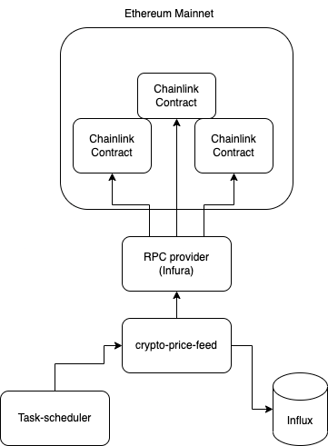

# Crypto Price Feed

fetch USD exchange rates for multiple cryptocurrencies (USDBTC, USDMATIC, USDETH, USDBNB, etc more is better) from any Oracle network like Chainlink (https://data.chain.link/)


## High Level Architecture

<a>  </img> </a>

## Environment Variables

To run this project, you will need to copy the .env.example and create a .env file

```
cd crypto-price-feed
cp .env.example .env
```

update `ETH_PROVIDER_URL` to an ETH mainnet provider URL
## Run Locally

Clone the project

```bash
  git clone https://github.com/jackey1510/Crypto-Price-Feed
```

Go to the project directory

```bash
  cd crypto-price-feed
```

Docker Compose

```bash
  docker compose up
```


## API Reference

http://localhost:8080/explorer/ for swagger reference.

#### Get the latest USD price for a token.

```http
  GET /latestUSDRate?token={token}
```

```
curl -X 'GET' \
  'http://localhost:8080/price/latestUSDRate?token=BTC' \
  -H 'accept: application/json'
```

#### Get USD price at a given time

```http
  GET /price/latestUSDRateAtTime?time={time}&fromToken={token}&minuteTolerance={minute}
```

```
curl -X 'GET' \
  'http://localhost:8080/price/latestUSDRateAtTime?time=2022-06-14T10%3A00%3A00Z&fromToken=MATIC&minuteTolerance=60' \
  -H 'accept: application/json'
```

minuteTolerance is the value to define the range to search.

e.g. minuteTolerance=60 will search between 1 hour before the timestamp and 1 hour after the timestamp.

#### Get USD price at a given time

```http
  GET price/averageUSDRate?startTime={date}&fromToken={token}&endTime={date}
```

```
curl -X 'GET' \
  'http://localhost:8080/price/averageUSDRate?startTime=2022-06-01T00%3A00%3A00Z&fromToken=BTC&endTime=2022-06-15T14%3A03%3A39.470Z' \
  -H 'accept: application/json'
```
## Influx DB Dashboard

Browse dashboard at http://localhost:8086/ to explore data
```
username: admin
password: adminpassword
```

## Fake data generation

Generate fake data for testing.

```
cd mock-data-generator
yarn
node .
```
